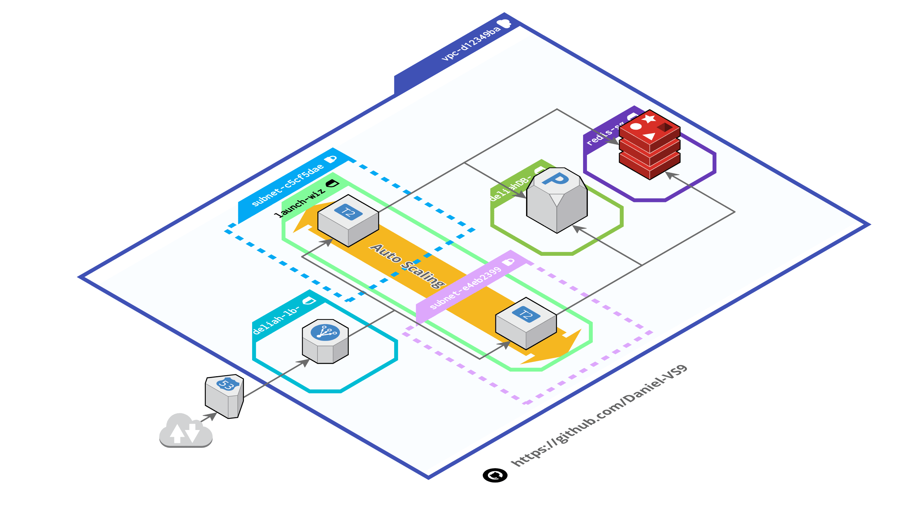

# API Deliah Resto
This API is made to facilitate the management of a restaurant. For this purpose it has three entities users, products and orders with the necessary CRUD operations.

## Resources
- Node.js
- Express.js
- Dotenv
- Swagger
- JWT
- Mysql
- Mocha
- Bcrypt
- Helmet
- Redis

_____________________________________________________________________________

## Installation<br/>
### 1. Clone the project
```
git clone https://github.com/Daniel-VS9/Deliah-resto-API.git
```
### 2. Install dependencies
```
npm install
```

### 3. Mysql
Configure MySQL database (you can use attached deliahDB.sql file)<br/><br/>

### 4. Redis
Be sure you have redis installed on your machine  <br/><br/>

### 5. Run the server
```
npm run start
```
or
```
npm run dev
```

______________________________________________________________________________
## AWS architecture


[Full size diagram](images/awsArchitecture.png)

_____________________________________________________________________________
## Tests
To start the test routine run
```
npm run test
```

______________________________________________________________________________
## Demo
You can see this project running [here](http://www.delilahresto.ga/api-docs)

______________________________________________________________________________

## Documentation 
[Documentation](http://localhost:3000/api-docs) can be accessed at http://localhost:3000/api-docs

Credentials:
| Email          | Pass |
|----------------|------|
| admin@mail.com | 1234 |
| abby@mail.com  | 1234 |

**\* Login in swagger documentation with email and pass**